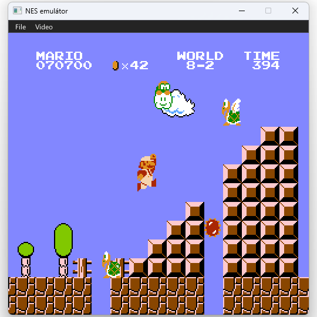

# NES Emulátor 

Az NES (Nintendo Entertainment System) egy 1980-as években megjelent 8-bites konzol, amelyből kb. 62 milliót darabot adtak el világszerte. Ez a program a konzol alapvető egységeit emulálja, és megjeleníti. Bár nem törekszik a legpontosabb emulációra, mégis elég pontos ahhoz, hogy többek közt lehessen rajta futtatni az erre a konzolra legtöbbet eladott játékot: Super Mario Bros.



# A példa buildelése

1. A repository rekurzívan klónozzuk, vagy klónozás után futtassuk a ``git submodule update --init --recursive`` parancsot. 
2. Futtassuk a ``lib/gl3w`` mappában futtassuk a ``gl3w_gen.py`` szkriptet
3. [Premake5](https://premake.github.io/download) segítségével a projekt gyökerében futtassuk Linux esetén ``premake5 gmake``-t, Windows esetén pedig ``premake5 vs2022``.
4. Ha Linuxot használunk, akkor töltsük le a ``gtk``-t. Pl. Ubuntun: ``sudo apt install libgtk-3-dev``
5. Linux esetén a projekt gyökerében futtassuk a ``make`` parancsot. Windows esetén nyissuk meg az létrehozott ``.sln`` fájlt, és ott fordítsuk.

# A core használata

1. NES.h fájlt includeoljuk be a projektbe.
2. Példányosítsuk az NES struktúrát (``NES* nes = CreateNES();``)
3. A következő függvényekkel tudunk kazettát belehelyezni, és újraindítani a konzolt: ``SetCartNES(NES* nes, char* path)``, ``ResetNES(NES* nes)``, ``RemoveCartNES(NES* nes)``. A ``RemoveCartNES``-t hívjuk meg minden ``SetCartNES`` előtt.
4. Futtassunk egy főciklust az emulátor bezárásig:<br>
4.1 Töltsük fel a ``nes->controller`` 8 gomb értékeit<br>
4.2 Hozzunk létre egy 256x240 RGB24 ``uint8_t`` buffert és állítsuk be az ``nes->ppu->display`` értéket annak címére.<br>
4.3 Hívjuk meg a ``TickNES``-t egy képkocka futtatásához.<br>
4.4 Az adott képkocka kirajzolandó képe megjelenik az ``nes->ppu->display``-ben.
5. Bezáráskor hívjuk meg a ``RemoveCartNES``, majd a ``DestroyNES`` függvényeket.


## Példa: main.c

Ez a fájl tartalmazza a program belépési pontját (``main``), és felelős az ablakkezelésért, a felhasználói bemenet feldolgozásáért, a grafikus felület (GUI) megjelenítéséért és a fő emulációs ciklus időzítéséért. A projekt **SDL2**-t használ az ablakkezeléshez és bemenethez, valamint **OpenGL 3.0**-t és **cimgui**-t a grafikus felülethez, továbbá **Native File Dialog**-ot egy fájl megnyitásakor.

Fontosabb konstansok:<br>
``WINDOW_SIZE``: A skálázási tényező. A natív NES felbontás (256x240) kétszerese kerül megjelenítésre (2 érték esetén).<br>
``FPS``: Képkocka per másodperc (60 FPS).

```c
int main(int argc, char* argv[])
```

A program:

1. SDL2, OpenGL, ImGui inicializálás
2. Ablak létrehozása: Létrehoz egy SDL ablakot "NES emulátor" címmel, középre igazítva. A méret az NES natív felbontás és a ``WINDOW_SIZE`` szorzata.
3. Betűtípus: Betölti a *Segoe UI* betűtípust a ``segoeui.h`` fájlból.
4. Emulátor inicializálás
    + Meghívja a ``CreateNES()`` függvényt az emulátor magjának példányosításához.
5. Létrehoz egy ``SDL_Texture``-t (``SDL_TEXTUREACCESS_STREAMING`` flaggel), amelyre a PPU egyből rajzol a ``TickNES``->``TickPPU`` során.
6. Főciklus 
    + A while blokk lefut minden képkockában, ameddig a felhasználó ki nem lép.
7. Leállítás
    + Eltávolítja a kazettát és megsemmisíti a NES példányt (``DestroyNES``).
    + Leállítja az ImGui-t, törli a textúrákat, ablakokat, kontextusokat és kilép az SDL-ből.

A főciklus:

+ A ``SDL_PollEvent`` hívással dolgozza fel az operációs rendszer eseményeit (pl. ablak bezárása), valamint továbbítja azokat az ImGui-nak.
+ Az SDL leolvassa a billyentűzetet és beállítja az ``nes->controller`` mezőket. 
+ Zárolja a megjelenítési textúrát (``SDL_LockTexture``), és a nyers pixel buffert közvetlenül átadja a ``nes->ppu->display`` mutatónak. Így a PPU közvetlenül az SDL textúrába rajzol.
+ Futtatás: Meghívja a ``TickNES`` függvényt, amely lefuttat egy teljes képkockányi emulációt.
+ Feloldja a textúrát, érvényesítve a PPU által írt adatokat.
+ Kezeli az ImGui rajzolást.
+ Kirajzolja a NES képernyőt tartalmazó textúrát a háttérbe (``SDL_RenderCopy``).
+ Rárajzolja az ImGui felületet (``ImGui_ImplOpenGL3_RenderDrawData``).
+ Kiszámítja az eltelt időt, és ha a feldolgozás gyorsabb volt, mint a célzott képkocka idő (MSPF, 60 FPS esetén kb. 16ms), akkor a maradék időt várakozással tölti (``SDL_Delay``).
